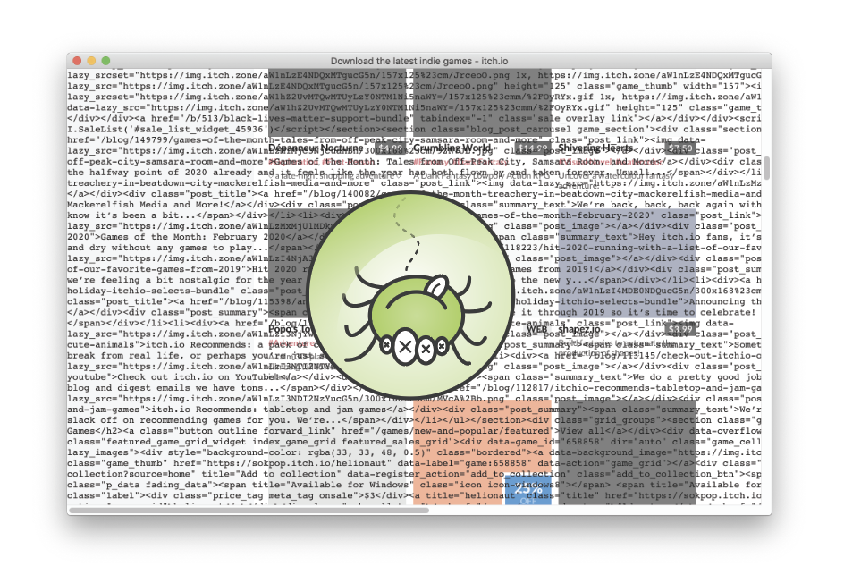

# kludgyKrawler v2.0

The internet is crawling with spiders! 🕷 A Web crawler, sometimes called a spider, web robot, or spiderbot is an Internet bot that systematically browses the World Wide Web. They are usually deployed by search engines, corporations, and governments to index what's on the Web. Increasingly, they're used to [scrape our photos](https://clearview.ai/) and [social media posts](https://www.inverse.com/article/8358-your-social-media-posts-are-fueling-the-future-of-police-surveillance) without our consent.

While most crawlers operate in shadows, kludgyKrawler stumbles into the foreground, [shredding the Web](https://www.potatoland.org/shredder/) while we watch. Simply enter a URL and watch kludgyKrawler trip all over itself as it imbibes and barfs the web–code and all–for us to bathe in. It's not perfect, nor are we.

(check out the [addon](https://github.com/nbriz/kludgykrawler/tree/addon) branch for the older/depreciated addon version of kludgyKrawler v1.0)

[Downloadable Windows, Linux && Mac binaries](https://github.com/nbriz/kludgykrawler/releases/tag/2.0) also available on [itch.io](https://skeuomorfx.itch.io/kludgykrawler)

## Dev Instructions

make sure u've got [node.js](https://nodejs.org/) installed.
then afer u've cloned this repo && `cd`'d into this directory run
```
npm install
```
...to download the dependencies && then
```
npm run start
```
...to run it from source

lastly/optionally run
```
npm run build
```
...to build the binaries (stand alone apps)
